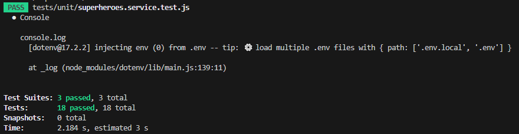
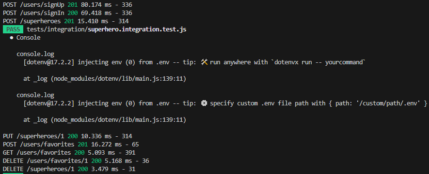
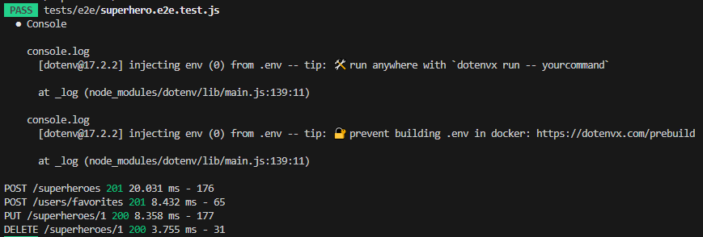
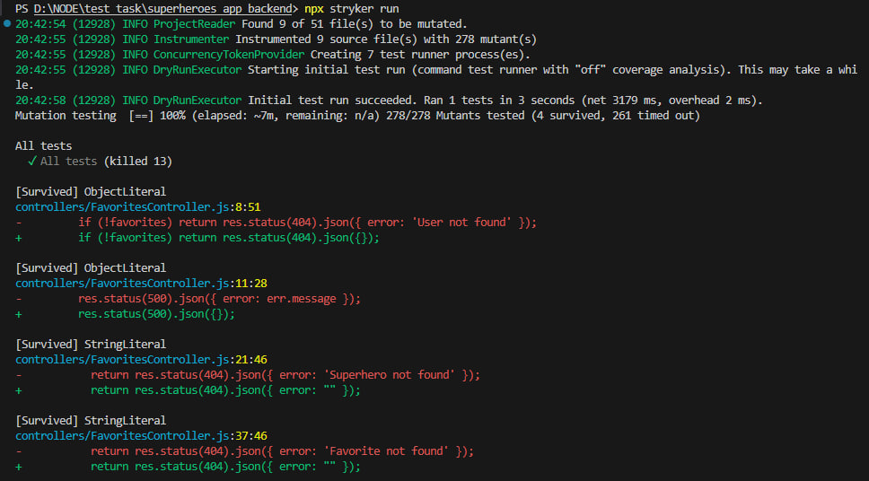
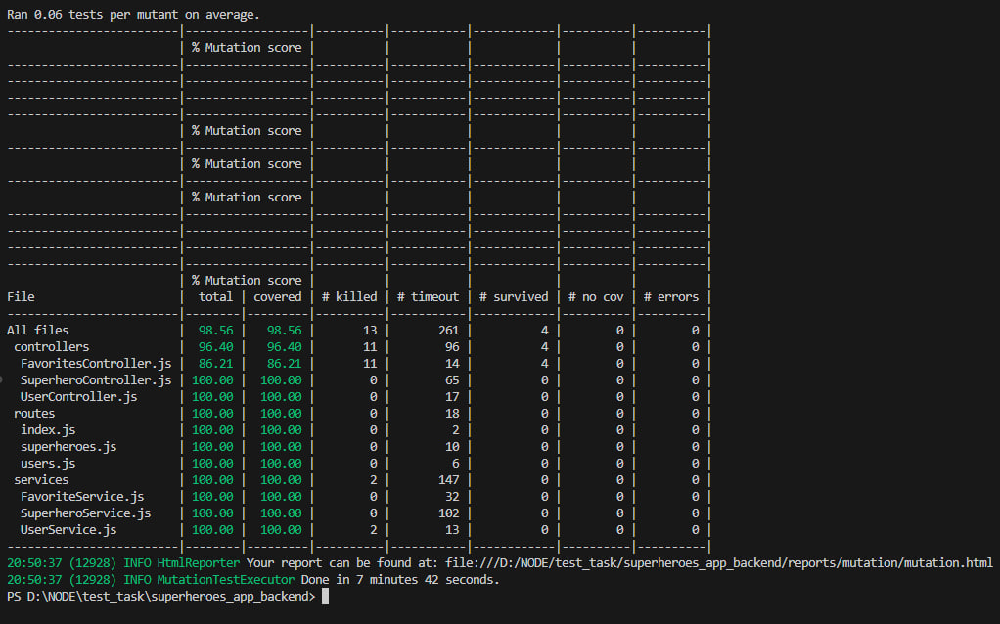

## Звіт про ефективність тестування “Superheroes App”

Проєкт: Superheroes App (Node.js + Express + Sequelize + PostgreSQL)
Інструменти тестування: Jest, Supertest, Stryker Mutator
Типи тестів:

Модульні (unit)

Інтеграційні

End-to-End (E2E)

Мутаційне тестування

---

### Оцінка ефективності тестів

Тестами покрито всі основні бізнес-процеси системи: реєстрація, автентифікація, CRUD для супергероїв, робота з улюбленими супергероями.

- Інтеграційні тести ефективно перевіряють зв’язки між модулями, сервером і базою даних.

- E2E сценарії повністю імітують дії реального користувача (створення, оновлення, видалення героїв).

- Мутаційне тестування показало, що більшість тестів дійсно виявляють помилки, а не просто перевіряють позитивні сценарії.

---

### Що ще варто зробити

- Додати негативні тести (перевірку обробки помилок, валідації, доступу без токена).

- Підвищити мутаційне покриття до 90%+ за допомогою детальніших юніт-тестів.

- Налаштувати автоматичний запуск тестів через GitHub Actions (CI/CD).

- Розширити E2E сценарії — додати тести з кількома користувачами й перевірку доступу до чужих даних.

---

### Висновок

Тестування проєкту “Superheroes App” є ефективним і практично повним: воно охоплює основні елементи системи, виявляє більшість критичних помилок і гарантує стабільну роботу застосунку.
Подальші поліпшення мають на меті збільшення глибини перевірки та автоматизацію процесу тестування.
